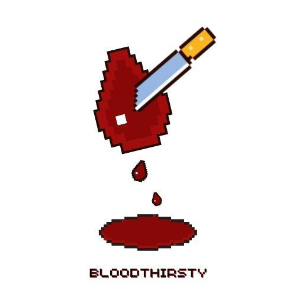
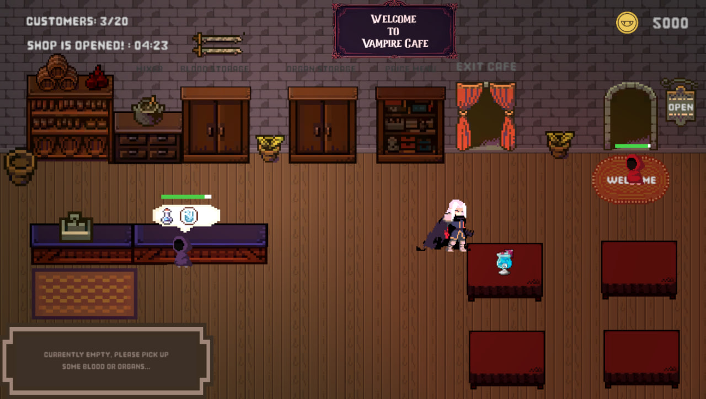
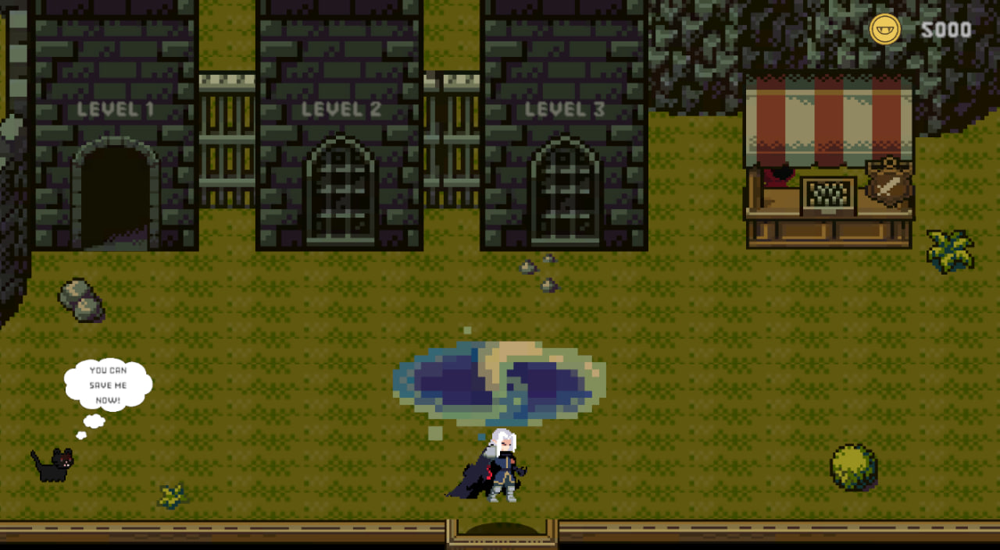
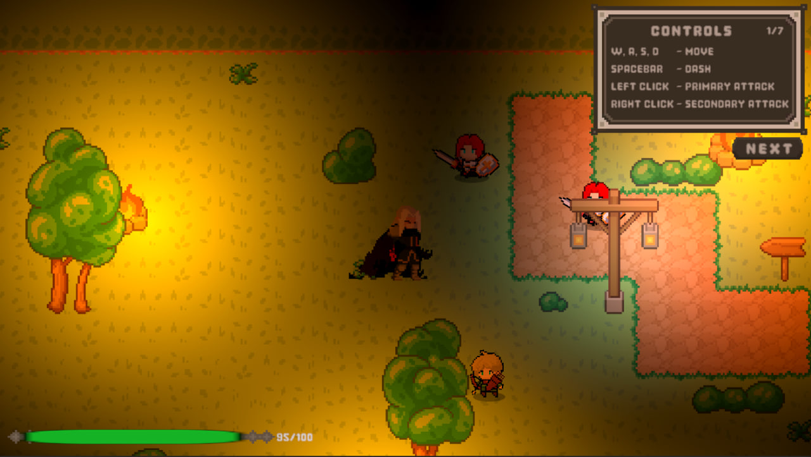

## BloodThirsty

  

<h4>Game Description</h4>
Blood Thirsty is a 2D top-down management-action game that invites players to embrace the dark and sophisticated world of a vampire connoisseur. Players balance the thrill of the hunt with the art of crafting exquisite blood-based dishes in their exclusive underground cafe. The game revolves around three core gameplay loops: managing the cafe during the day, engaging in combat by night, and strategically managing the resources gathered from human hunts.

<h4>Genre</h4>

<strong>Blood Thirsty</strong> is a game that blends <em>Dungeon Crawling</em> with <em>Café Management</em> mechanics.

<h4>The premise</h4>

You are a vampire running a vampire café in the day. At night, you hunt in the dungeons for blood and organ ingredients essential for crafting an unique, tasty drink for your customers.

<h4>System requirements</h4>
<table cellpadding="8" cellspacing="0">
  <thead>
    <tr>
      <th>Component</th>
      <th>Windows</th>
      <th>Mac OS</th>
    </tr>
  </thead>
  <tbody>
    <tr>
      <td><strong>Operating System</strong></td>
      <td>Windows 7 SP1+, Windows 10, or Windows 11 (64-bit)</td>
      <td>macOS 10.13 (High Sierra) or later</td>
    </tr>
    <tr>
      <td><strong>Processor</strong></td>
      <td>Intel Core i3 or AMD Ryzen 3 or higher</td>
      <td>Intel Core i5 (or equivalent)</td>
    </tr>
    <tr>
      <td><strong>Graphics</strong></td>
      <td>Graphics card with support for DirectX 11 or higher</td>
      <td>Integrated graphics (Intel Iris, Apple Silicon GPU, or equivalent) Metal compatible GPU</td>
    </tr>
    <tr>
      <td><strong>Memory</strong></td>
      <td>8 GB RAM minimum (16 GB recommended)</td>
      <td>8 GB RAM</td>
    </tr>
    <tr>
      <td><strong>Storage</strong></td>
      <td>SSD recommended 2 GB or more of free disk space</td>
      <td>2 GB or more of free disk space</td>
    </tr>
  </tbody>
</table>

### How to play the game

<h4>Controls Required</h4>
<table cellpadding="8" cellspacing="0">
  <thead>
    <tr>
      <th>Key</th>
      <th>Action</th>
    </tr>
  </thead>
  <tbody>
    <tr>
      <td>W</td>
      <td>Move Forward</td>
    </tr>
    <tr>
      <td>A</td>
      <td>Move Left</td>
    </tr>
    <tr>
      <td>S</td>
      <td>Move Backward</td>
    </tr>
    <tr>
      <td>D</td>
      <td>Move Right</td>
    </tr>
    <tr>
      <td>Q</td>
      <td>Interact (Human World)</td>
    </tr>
    <tr>
      <td>Left-Click</td>
      <td>Primary Attack (Human World)</td>
    </tr>
    <tr>
      <td>Right-Click</td>
      <td>Secondary Attack (Human World)</td>
    </tr>
    <tr>
      <td>E</td>
      <td>Inventory (Human World / Vampire World)</td>
    </tr>
    <tr>
      <td>Space-bar</td>
      <td>Dash (Human World)</td>
    </tr>
    <tr>
      <td>T</td>
      <td>Toggle Combat Tutorial</td>
    </tr>
  </tbody>
</table>

<h4>Game Procedures:</h4>
<ul>
  <li>The player begins the game from the <strong>Main Menu</strong>, choosing either <em>Start New</em> or <em>Load Game</em> to enter the gameplay loop.</li>
  
  <li>The cycle begins with the <strong>Cafe phase</strong>, where the player crafts drinks for customers.</li>
  <li>The cafe stays open until the player runs out of ingredients or decides to close early.</li>
  
  <li>After closing, the player moves to the <strong>Dungeon Hub</strong> to upgrade cafe features and hunting abilities.</li>
  
  <li>The player then enters the <strong>Hunt phase</strong> (in the dungeons), collecting blood and organs to restock for the next cycle.</li>
  <li>Repeat the cycle, and once 5,000 Bitecoins is earned, the ultimate goal will be reached which is to save Midnight the cat !</li>
</ul>

### Gameplay

[Video Link](https://drive.google.com/file/d/10FkZrce5Rfbn-EZYAtmuoJWTf9GJtDYR/view?usp=drive_link)

### Other information

<b>Tutorial:</b> A detailed step by step tutorial is available for new players when they first visit each scene. It covers basic mechanics such as making drinks, navigating within cafe, dungeon hub and combat controls in the dungeon.
 
<b>Game Progression:</b> Unlockable content such as blood, new organs, recipes, and dungeons are tied to your performance in hunting phase.

The executable runs only on Windows with a 1920 X 1080 aspect ratio!
